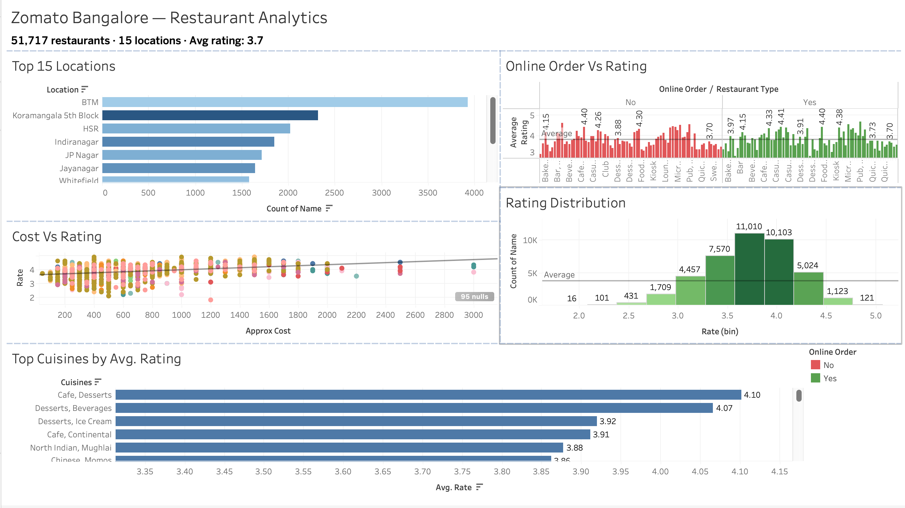

# 🍽️ ZomatoBangalore — Restaurant Analytics

A full-stack data analytics project analyzing **51,717+ restaurants** across Bangalore using the Zomato dataset. Covers data ingestion, cleaning, transformation via dbt, and interactive visualization via Tableau.

> 📊 **Dashboard:** [Coming Soon](#) — Preview available at [`dashboards/dashboard_preview.png`](dashboards/dashboard_preview.png)

---

## 📁 Project Structure

```
ZomatoBangalore/
├── dashboards/
│   └── dashboard_preview.png       # Static dashboard preview
├── data/
│   ├── processed/
│   └── raw/
├── notebooks/
│   └── eda.ipynb                   # Exploratory data analysis
├── plots/                          # All generated visualizations
│   ├── avg_rating_by_location.jpg
│   ├── avg_rating_by_type.jpg
│   ├── cost_distribution.jpg
│   ├── cost_vs_no_booking.jpg
│   ├── online_vs_offline_rating.jpg
│   ├── restaurant_type_breakdown.jpg
│   ├── restaurant_count.jpg
│   ├── top_cuisines_rating.jpg
│   ├── top_location_count.jpg
│   └── votes_rating.jpg
├── src/
│   ├── __init__.py
│   ├── clean.py                    # Data cleaning pipeline
│   └── load.py                     # Data loading utilities
├── zomato_dbt/                     # dbt transformation layer
│   ├── dbt_project.yml
│   └── models/
│       ├── marts/
│       │     ├── dim_cuisine.sql
│       │     ├── dim_location.sql
│       │     ├── dim_restaurant_type.sql
│       │     └── fct_restaurants.sql
│       └── staging/
│           ├── schema.yml
│           ├── sources.yml
│           └── stg_zomato.sql
├── Makefile
├── pyproject.toml
├── README.md
└── requirements.txt
```

---

## 🔧 Tech Stack

| Layer | Tool |
|---|---|
| Data Source | Kaggle — Zomato Bangalore Dataset |
| Data Cleaning | Python (Pandas) |
| Transformation | dbt (Data Build Tool) |
| Exploration | Jupyter Notebook |
| Visualization | Tableau Desktop |
| Package Management | uv / pyproject.toml |

---

## 📊 Dashboard

> 🔗 **Live Dashboard:** Coming Soon
>
> In the meantime, view the static preview:



### Sheets included in the dashboard:

| Sheet | Chart Type | Description |
|---|---|---|
| Top 15 Locations | Horizontal Bar | Restaurant count by area, coloured by avg rating |
| Rating Distribution | Histogram | Distribution of ratings in 0.5 buckets |
| Online Order vs Rating | Side-by-side Bar | Online vs offline avg rating split by restaurant type |
| Cost vs Rating | Scatter Plot | Approx cost vs rating with trend line, coloured by location |
| Top Cuisines by Avg Rating | Horizontal Bar | Cuisines with 100+ restaurants, ranked by avg rating |

---

## 🚀 Getting Started

### 1. Clone the repository

```bash
git clone https://github.com/meet7364/ZomatoBangalore.git
cd ZomatoBangalore
```

### 2. Install dependencies

```bash
uv sync
```

### 3. Run data cleaning

```bash
uv run python src/clean.py
```

This reads `data/raw/zomato.csv`, cleans it, and outputs `data/processed/zomato_clean.csv`.

### 4. Run dbt transformations

```bash
make dbt-all
```

### 5. Explore the data

Open and run `notebooks/eda.ipynb` to explore distributions, top locations, cuisine ratings, and more.

---

## 🧹 Data Cleaning Steps

The raw Zomato dataset required significant cleaning before analysis:

- Extracted numeric rating from strings like `"4.1/5"` → `4.1`
- Removed commas from cost values like `"1,200"` → `1200`
- Dropped rows with `"NEW"` or `"-"` as rating values
- Handled null values in `approx_cost`, `cuisines`, and `location`
- Standardised `online_order` and `book_table` to boolean values

---

## 🏗️ dbt Models

### Staging
- `stg_zomato.sql` — base cleaning and type casting from raw source

### Marts
- `dim_location.sql` — unique locations dimension
- `dim_cuisine.sql` — unique cuisines dimension
- `dim_restaurant_type.sql` — restaurant type dimension
- `fct_restaurants.sql` — fact table joining all dimensions with ratings, cost, votes

### Tests
- Not-null checks on key fields
- Unique constraints on dimension primary keys
- Accepted value ranges for ratings

---

## 📈 Key Insights

- **BTM Layout** has the highest restaurant count (3,930+) in Bangalore
- Restaurants that accept **online orders** have a slightly higher avg rating (3.72) vs offline (3.66)
- **Cafe, Desserts** cuisine combination has the highest avg rating (4.10) among popular cuisines
- Most restaurants are rated between **3.5 and 4.0**
- Higher cost restaurants tend to have marginally better ratings (positive trend line)

---

## 📦 Dataset

- **Source:** [Zomato Bangalore Restaurants — Kaggle](https://www.kaggle.com/datasets/himanshupoddar/zomato-bangalore-restaurants)
- **Size:** ~51,000+ restaurant records
- **Fields:** name, location, cuisines, approx_cost, rate, votes, online_order, book_table, rest_type, listed_type

---

## 🙌 Acknowledgements

- Dataset by Kaggle community contributors
- dbt for making SQL transformations modular and testable
- Tableau for interactive dashboard visualisation

## Author

**Meet Modi** — B.Tech CSE (Data Science), VIT Chennai  
[LinkedIn](https://www.linkedin.com/in/meet-modi-bb57752b8/) · [GitHub](https://github.com/meet7364)